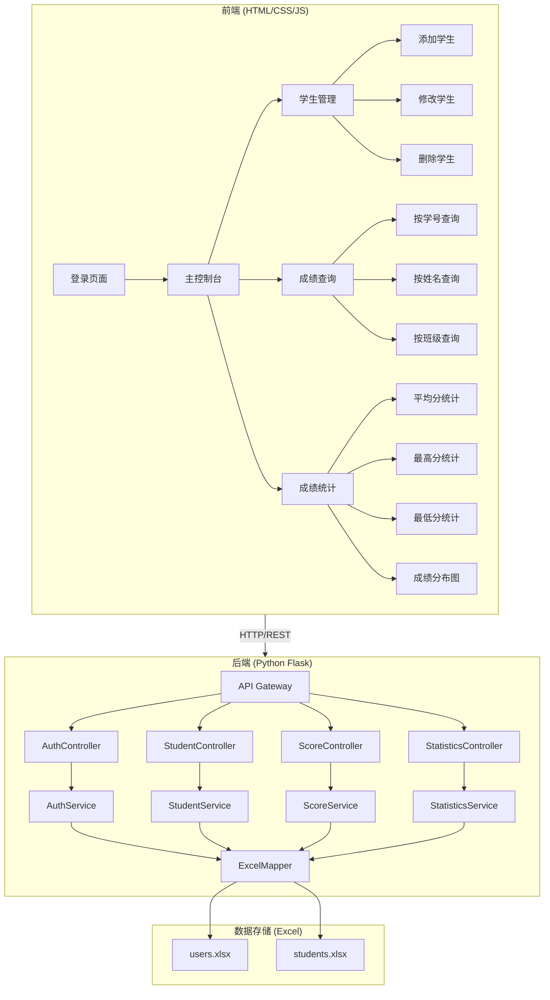
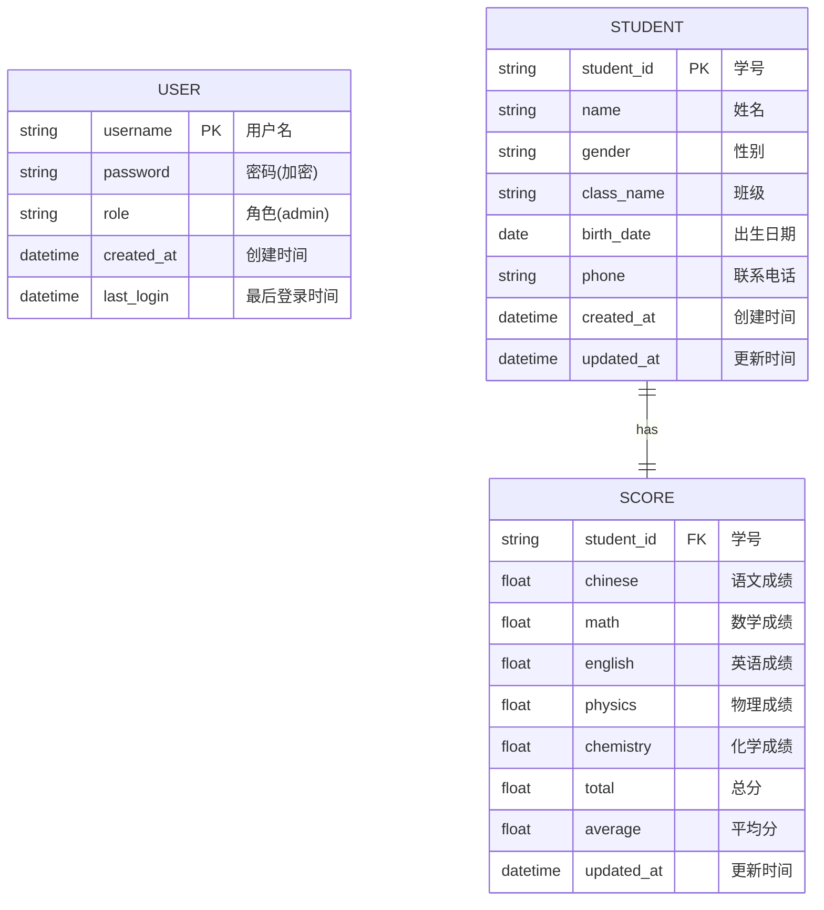

# 学生成绩管理系统 - 项目设计文档

## 1. 系统概述

基于 Python + Excel 的学生成绩管理系统，采用 B/S 架构，前端使用原生 HTML/CSS/JS，后端使用 Python Flask 框架，数据存储使用 Excel 文件。

## 2. 系统架构



## 3. 数据模型 (ER 图)



## 4. 接口清单

### 4.1 认证模块 (AuthController)

| 方法 | 路径 | 描述 | 请求参数 | 响应 |
|------|------|------|----------|------|
| POST | /api/auth/login | 用户登录 | username, password | token, user_info |
| POST | /api/auth/logout | 用户登出 | token | success |
| GET | /api/auth/profile | 获取用户信息 | token | user_info |
| PUT | /api/auth/password | 修改密码 | old_password, new_password | success |

### 4.2 学生管理模块 (StudentController)

| 方法 | 路径 | 描述 | 请求参数 | 响应 |
|------|------|------|----------|------|
| GET | /api/students | 获取学生列表 | page, size, keyword | students[], total |
| GET | /api/students/{id} | 获取学生详情 | student_id | student |
| POST | /api/students | 添加学生 | student_info | student |
| PUT | /api/students/{id} | 修改学生信息 | student_info | student |
| DELETE | /api/students/{id} | 删除学生 | student_id | success |
| POST | /api/students/import | 批量导入学生 | excel_file | import_result |
| GET | /api/students/export | 导出学生数据 | filters | excel_file |

### 4.3 成绩管理模块 (ScoreController)

| 方法 | 路径 | 描述 | 请求参数 | 响应 |
|------|------|------|----------|------|
| GET | /api/scores | 获取成绩列表 | page, size, filters | scores[], total |
| GET | /api/scores/{student_id} | 获取学生成绩 | student_id | score |
| PUT | /api/scores/{student_id} | 修改学生成绩 | score_info | score |
| GET | /api/scores/export | 导出成绩数据 | filters | excel_file |

### 4.4 统计分析模块 (StatisticsController)

| 方法 | 路径 | 描述 | 请求参数 | 响应 |
|------|------|------|----------|------|
| GET | /api/statistics/overview | 获取总览数据 | - | overview |
| GET | /api/statistics/subject | 按科目统计 | subject | stats |
| GET | /api/statistics/class | 按班级统计 | class_name | stats |
| GET | /api/statistics/distribution | 成绩分布统计 | subject | distribution |
| GET | /api/statistics/ranking | 成绩排名 | subject, limit | ranking[] |

## 5. UI/UX 设计规范

### 5.1 色彩系统

| 用途 | 色值 | 说明 |
|------|------|------|
| 主背景色 | #F8F9FA | 浅灰底色，降低视觉疲劳 |
| 主面板/卡片色 | #FFFFFF | 纯白卡片，突出内容 |
| 主功能色 | #36B37E | 低饱和绿，专业不刺眼 |
| 辅助色(警告) | #FFAB00 | 暖黄警告，不突兀 |
| 辅助色(危险) | #FF5630 | 低饱和红，醒目不刺眼 |
| 文本主色 | #172B4D | 深灰黑，易读性高 |
| 文本次色 | #6B778C | 中灰，次要说明文字 |
| 边框/分割线 | #EEEEEE | 极简分割 |

### 5.2 布局规范

- 左侧导航栏：固定宽度 200px
- 顶部栏：面包屑 + 用户信息，高度 60px
- 内容区：卡片式布局，圆角 8px
- 间距系统：8px / 16px / 24px / 32px
- 最小留白：24px

### 5.3 组件规范

#### 按钮
- 主按钮：背景 #36B37E，文字 #FFFFFF，圆角 6px
- 次按钮：背景 #FFFFFF，边框 #36B37E，文字 #36B37E
- 危险按钮：背景 #FF5630，文字 #FFFFFF
- Hover：色值加深 5%，阴影 `box-shadow: 0 2px 8px rgba(0,0,0,0.08)`
- 禁用：透明度 50%

#### 卡片
- 背景：#FFFFFF
- 圆角：8px
- 阴影：`box-shadow: 0 1px 4px rgba(0,0,0,0.05)`
- 内边距：24px

#### 表格
- 斑马线：#F8F9FA 和 #FFFFFF 交替
- Hover 行：#EFF8F5
- 无竖线分割
- 行高：≥40px

#### 输入框
- 边框：#EEEEEE
- 圆角：6px
- 高度：40px
- Focus：边框 #36B37E

### 5.4 字体规范

- 字体：Inter, 思源黑体, sans-serif
- 标题：16-18px，#172B4D
- 正文：14px，#172B4D
- 辅助文字：12px，#6B778C
- 行高：1.5

### 5.5 图标规范

- 风格：线性图标，粗细 2px
- 尺寸：16px / 24px
- 颜色：与文本次色或主功能色一致

## 6. 页面设计

### 6.1 登录页面
- 居中卡片式登录框
- Logo + 系统名称
- 用户名/密码输入框
- 登录按钮
- 记住密码选项

### 6.2 主控制台
- 左侧：导航菜单（学生管理、成绩查询、统计分析）
- 顶部：面包屑 + 用户下拉菜单
- 内容区：数据概览卡片（学生总数、平均分、最高分、最低分）

### 6.3 学生管理页面
- 搜索栏：学号/姓名/班级筛选
- 操作栏：添加学生、批量导入、导出
- 数据表格：学号、姓名、性别、班级、操作（编辑/删除）
- 分页组件

### 6.4 成绩查询页面
- 搜索栏：学号/姓名/班级/科目筛选
- 数据表格：学号、姓名、各科成绩、总分、平均分、操作（编辑）
- 分页组件

### 6.5 统计分析页面
- 概览卡片：各科平均分、最高分、最低分
- 成绩分布图表
- 班级对比图表
- 排名列表

## 7. 技术选型

### 7.1 前端
- HTML5 + CSS3 + JavaScript (ES6+)
- 无框架依赖，原生实现
- Chart.js 用于图表展示

### 7.2 后端
- Python 3.9+
- Flask 2.x (Web 框架)
- openpyxl (Excel 操作)
- Flask-CORS (跨域支持)
- PyJWT (Token 认证)
- Werkzeug (密码加密)

### 7.3 数据存储
- Excel 文件 (.xlsx)
- users.xlsx：用户数据
- students.xlsx：学生及成绩数据

## 8. 目录结构

```
student-score-system/
├── backend/                    # 后端项目
│   ├── app/
│   │   ├── __init__.py        # Flask 应用初始化
│   │   ├── config.py          # 配置文件
│   │   ├── controllers/       # 控制器层
│   │   │   ├── __init__.py
│   │   │   ├── auth_controller.py
│   │   │   ├── student_controller.py
│   │   │   ├── score_controller.py
│   │   │   └── statistics_controller.py
│   │   ├── services/          # 服务层
│   │   │   ├── __init__.py
│   │   │   ├── auth_service.py
│   │   │   ├── student_service.py
│   │   │   ├── score_service.py
│   │   │   └── statistics_service.py
│   │   ├── mappers/           # 数据访问层
│   │   │   ├── __init__.py
│   │   │   └── excel_mapper.py
│   │   ├── models/            # 数据模型
│   │   │   ├── __init__.py
│   │   │   ├── user.py
│   │   │   ├── student.py
│   │   │   └── score.py
│   │   ├── utils/             # 工具类
│   │   │   ├── __init__.py
│   │   │   ├── response.py
│   │   │   ├── validators.py
│   │   │   └── logger.py
│   │   └── exceptions/        # 异常处理
│   │       ├── __init__.py
│   │       └── handlers.py
│   ├── data/                  # Excel 数据文件
│   │   ├── users.xlsx
│   │   └── students.xlsx
│   ├── logs/                  # 日志目录
│   ├── requirements.txt       # Python 依赖
│   ├── Dockerfile
│   └── run.py                 # 启动入口
├── frontend-admin/            # 前端项目
│   ├── index.html            # 登录页
│   ├── dashboard.html        # 主控制台
│   ├── css/
│   │   ├── common.css        # 公共样式
│   │   ├── login.css         # 登录页样式
│   │   └── dashboard.css     # 控制台样式
│   ├── js/
│   │   ├── api/              # API 调用层
│   │   │   ├── request.js    # 请求封装
│   │   │   ├── auth.js
│   │   │   ├── student.js
│   │   │   ├── score.js
│   │   │   └── statistics.js
│   │   ├── store/            # 状态管理
│   │   │   └── store.js
│   │   ├── components/       # 组件
│   │   │   ├── toast.js      # 消息提示
│   │   │   ├── modal.js      # 弹窗
│   │   │   ├── table.js      # 表格
│   │   │   └── pagination.js # 分页
│   │   ├── views/            # 页面逻辑
│   │   │   ├── login.js
│   │   │   ├── dashboard.js
│   │   │   ├── student.js
│   │   │   ├── score.js
│   │   │   └── statistics.js
│   │   └── utils/            # 工具函数
│   │       └── utils.js
│   ├── assets/               # 静态资源
│   │   └── icons/            # 图标
│   ├── Dockerfile
│   └── nginx.conf            # Nginx 配置
├── docker-compose.yml
├── .gitignore
└── README.md
```

## 9. 安全设计

### 9.1 认证机制
- JWT Token 认证
- Token 有效期：24 小时
- 密码加密：Werkzeug pbkdf2

### 9.2 接口安全
- 所有 API 需携带 Token（登录接口除外）
- 参数校验
- SQL 注入防护（Excel 操作无此风险）
- XSS 防护

### 9.3 日志记录
- 登录/登出日志
- 增删改操作日志
- 异常日志

## 10. 功能清单

### 核心功能
- [x] 用户登录/登出
- [x] 添加学生信息
- [x] 查询学生成绩
- [x] 修改学生成绩
- [x] 删除学生信息
- [x] 统计成绩（平均分、最高分、最低分）

### 扩展功能
- [x] 批量导入学生
- [x] 导出学生/成绩数据
- [x] 成绩分布图表
- [x] 班级成绩对比
- [x] 成绩排名
- [x] 修改密码
